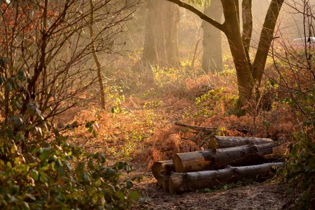

Friends of Ashenground and Bolnore Woods is made up of local people, including walkers, nature lovers, dog owners and family groups, interested in caring for the Woods. New members are always welcome. The group organises a regular program of task days, nature walks and special interest events, monitors and influences development of the surrounding area, and promotes responsible use by local residents.

Task days involve work in the woodland, including coppicing, as well as more straight forward tasks such as litter picking. Flora and fauna surveys are carried out to monitor carefully any changes in species over time. Links with local schools and other developments are a key aspect of planning for the future.

Regular newsletters are produced and contributions from members are always welcome.

## Royal Horticultural Society and Britain in Bloom 2023 present us with an "Outstanding" Award!

2022 FoABW Conservation Volunteers received a Special Award from Haywards Heath in Bloom from Cllr Sandy Ellis, Haywards Heath Town Council.

FoABW received the Community Involvement Award in the Discretionary category of the South and South East in Bloom 2012 competition.

## Joining Our Committee

FoABW would like to expand representation on our Committee. We meet about once every three months and we are friendly group, all obviously keen on protecting and enhancing the Nature Reserve. If you would like to find out more about joining our Committee and what it involves, then do please contact our Chair, Lorraine Maynard
