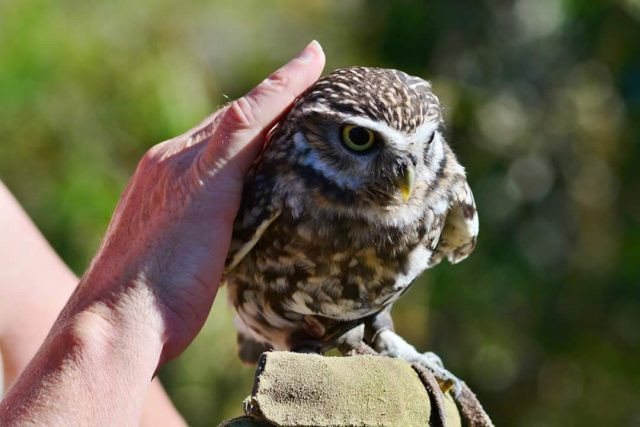
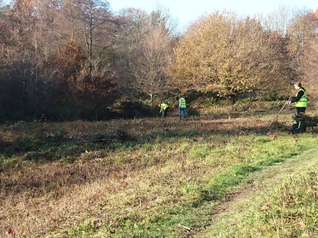

## Events and Work through the winter

### Conservation

The Conservation Volunteers meet at 10.00 a.m on the 1st and 3rd Saturday of each month in the Winter for 2 -3 hours (October – March)   From April, the Summer schedule is in place (check Summer Schedule Poster when applicable).  

The meeting place is at the Thatched Cottage in Bolnore Village for both days. It is conveniently close to our new tool store.  If you live outside Bolnore Village, the Thatched Cottage is accessible via the Bridleway from Ashenground Railway Bridge. The meeting place is where Renfields crosses the Bridleway.  

Not all the work involves coppicing –we are also busy mowing the grassy places, and cutting back path edges. Litter picking and other light work for the less fit is also an important element. All tools are provided.

You don’t need experience –training will be given.  Please wear stout footwear.

Members and non-members are welcome, but under 16s must be accompanied by an adult, who will be responsible for them throughout.

[Conservation Poster](uploads/2018/06/Conservation-Poster-Updated.pdf)

---

We run some special events during the year. Members and non-members are welcome. Information about these will be posted here, on the notice boards in the woods and on our Facebook page. Events are **Free of Charge** to members and non-members.  Under 16s must be accompanied by an adult, who will be responsible for them throughout.

## Events Planned for 2023

- A.G.M.  12th March 2023 at The Ascension Community Centre, Vale Road, HH. Start time 3pm. Members & Non-members welcome.
- Photography Afternoon with Brian Watson.  Date  and Time T.B.A.
- Children's Bug Hunt with MSDC Ranger and Debby Martell.  Date and Time T.B.A 
- Bird of Prey Afternoon.   Date and Time T.B.A
- Evening Bat Walk.   Date and Time T.B.A.

## 2021 Accounts 

Minutes of 2022 A.G.M (and Conservation Activity Report 2022) 

[2021 FoABW account](uploads/2022/02/2021-FoABW-accounts.pdf)

[Minutes AGM 13th March 2022](uploads/2022/03/Minutes-AGM-13th-March-2022.pdf)

## Information Lecterns

Mid Sussex District Council have placed Information Lecterns in Pond Meadow, The Great Spreading Oak in Renfields, Railway Path, Boundary Path (near School),  Renfields top of Bridleway. Catts Wood and Bolnore Wood.

**Sussex Stag Beetle Initiative** would like you to consider making a home in your garden for Stag Beetles. It is very simple, see their instructions – click on the poster below. These fabulous creatures are our largest native beetle and they are under threat. The adult beetle only lives for a few weeks in the summer, their breeding season is very short. Their larvae develop underground, this takes several years, they live on rotting wood during this time, building up fat stores until they develop in to adults. The females remain in the area, the males fly off in pursuit of a female. (For more details of Sussex Stag Beetle Initiative, please go to their Facebook page)

[Build-a-log-pile-for-stag-beetles](uploads/2018/03/Build-a-log-pile-for-stag-beetles.pdf)
