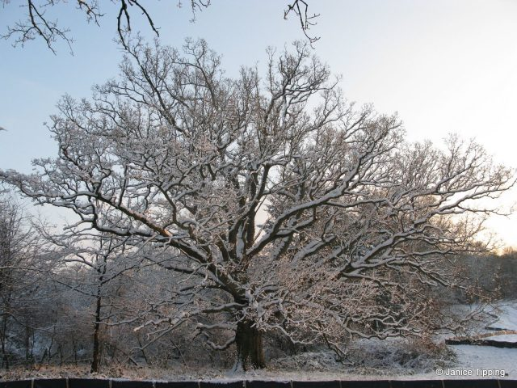
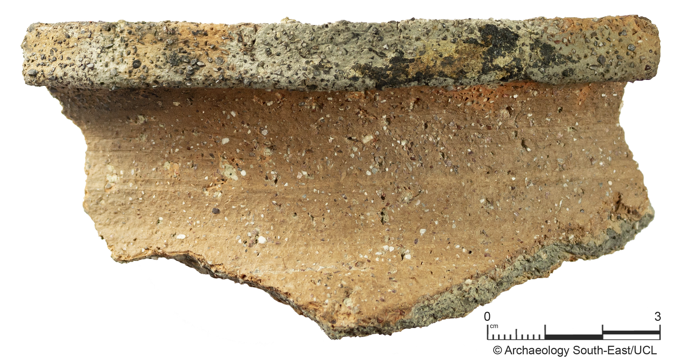

Ashenground and Bolnore Woods Local Nature Reserve is a small area of beautiful ancient woodland in Haywards Heath, lying to the south of the bridleway that runs from Ashenground Road to Bolnore village. It includes Ashenground Wood, Pierce’s Wood, Catts Wood and Bolnore Wood. This unique habitat has been acquired by Mid-Sussex District Council. The area is popular with local residents and is a valuable wildlife refuge and resource. A friends group, Friends of Ashenground and Bolnore Woods, helps care for the woods for the benefit of the whole community.

In 2008 the Woods were formally declared a Local Nature Reserve (LNR) with the approval of Natural England and with the support of Mid Sussex District Council and Sussex Wildlife Trust. There are permissive paths through all the woods, and a public bridleway immediately to the north. The bridleway has been upgraded and now provides a link from Ashenground up to Bolnore Road that is easily accessible throughout the year. 

## History

Woodland which is described as ‘Ancient’ has existed for at least 400 years, and in many cases has formed part of the landscape since the end of the last Ice Age. It has not always been tree-covered, but has been harvested as a sustainable crop (coppiced), or used for grazing from time to time. It now covers less than 2% of the U.K. Such woods have had a long time to acquire species, and form stable ecological communities. They support a greater variety of plants and animals than most other habitats. Their ecology is fragile – many woodland species do not easily colonise new areas, and disappear when disturbed. Ashenground Wood in particular is part of this heritage.

We are still using the old names for individual woods, but sometimes in memory of the woods which have disappeared under the houses on both sides of the railway. Some fine specimens of oak and hornbeam from these woods remain in the roads and gardens of the built up area.

An ancient bridleway runs from the western end of Ashenground Road to Isaacs Lane. North of the bridleway were woods and meadows which appeared on an estate map of 1638 in almost the same positions. Sadly these are now in the process of being developed to form the last phases of Bolnore Village, except for one small meadow – Four Acre Wood. This was saved from development after a public inquiry showed it was ancient woodland. A group of local community organisations which included FoABW played a significant part in this outcome.

More recently, archaeologists working in these fields before the building could begin found evidence of at least one building of considerable size on the south-facing slope, and numerous other features – tracks and ditches, and possible animal enclosures. They have also found pottery which enables them to date the occupation of the site to late twelfth/early thirteenth century.

The building has some massive post holes associated with it which suggest a building requiring strong support, perhaps of a huge roof, or even of an extra storey. It may have housed people in one half and animals in the other, or perhaps people above.

The settlement seems to have had a track linking it with the bridleway, and there is evidence that at this time there was a stream flowing down the middle of the field. It was probably not a pioneer settlement, but developed under the auspices of the Lord of the Manor – perhaps of Hayward, or Trubwyk. There is no written evidence.

A series of ponds follows the line of the bridleway westwards. These were old quarries, and are now home to a variety of wild life, including the great crested newt, which is a protected species.

---

Those of you who came on the Walk Through History of the Wood, led by Stuart Meier and those who are FoABW members and received our recent Newsletter will be familiar with the archaeological dig in Phase 4 of Bolnore Village in 2006. Nicola Elphick MA, Archive Officer and the team at Archaeology South-East (UCL) have very kindly allowed us to publish their ‘photos and descriptions of each of the finds from the dig. We would like to express our thanks for all the help and information they have provided.

(Photos and captions courtesy of Archaeology South-East)

Photo 1: BVD06- 4: This pottery sherd was uncovered during the 2006 archaeological excavations here in Bolnore. This sherd is part of the rim of a medieval cooking pot.

Photo 2: BVD06-104: Part of a circular grindstone in a light grey sandstone. The stone is 90mm thick with a 100mm diameter hole at its centre. A grindstone would have been used to sharpen tools.

Photo 3: BVD06- 107: Given its weight (an impressive 870g) and its shape, this axe could be described as an axe preform. It displays the alternate flake scar removals corresponding to the early stage of shaping and thinning once the initial axe roughout has been obtained. The axe “preform” measures 220mm long, up to 85mm wide and 45mm thick and is thought to be from the Neolithic period.

Photo 4: BVD06- 359: An end-and-side scraper with evidence of retouch along the right hand edge and end. It is thought this piece dates back to the Neolithic and was uncovered in a large ditch here in Bolnore.
