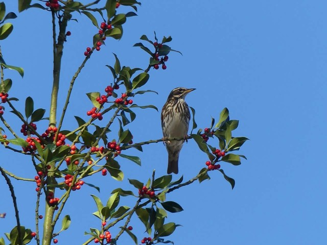

## Wildlife Sighting Recording

Lorraine Maynard records sightings of birds, plus other fauna and flora, seen in the woods. Please let Lorraine know if you see any birds or other fauna and flora – unusual or common (contact details at foot of page).

[Sightings Report Winter 2022](uploads/2022/03/FoABW-Sightings-Report-WINTER-DEC-JAN-2022-FEB.pdf)

### Snapshot of Inveterate Life in Ashenground & Bolnore Woods by Krisztina Fekete.

[Snapshot of Invertebrate Life in Ashenground & Bolnore Woods 2017/2018](uploads/2019/07/Ashenground-Woods-article.pdf)

### Winter 2016 Survey by Krisztina Fekete

Krisztina carried out a seasonal survey of AGW for Mosses, Lichens, Insects.

[Ashenground & Bolnore Woods Bryophyte Survey 2016 WInter](uploads/2017/03/Ashenground-Bolnore-Woods-Bryophyte-Survey-2016-WInter.pdf)
